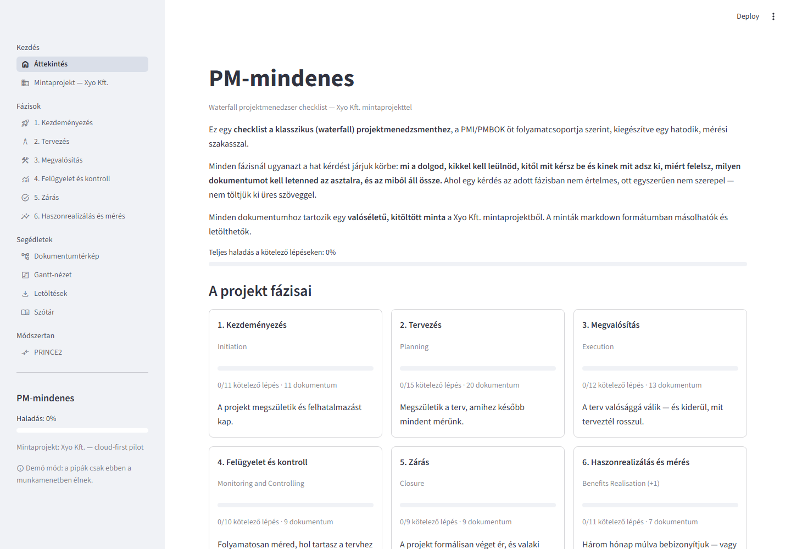
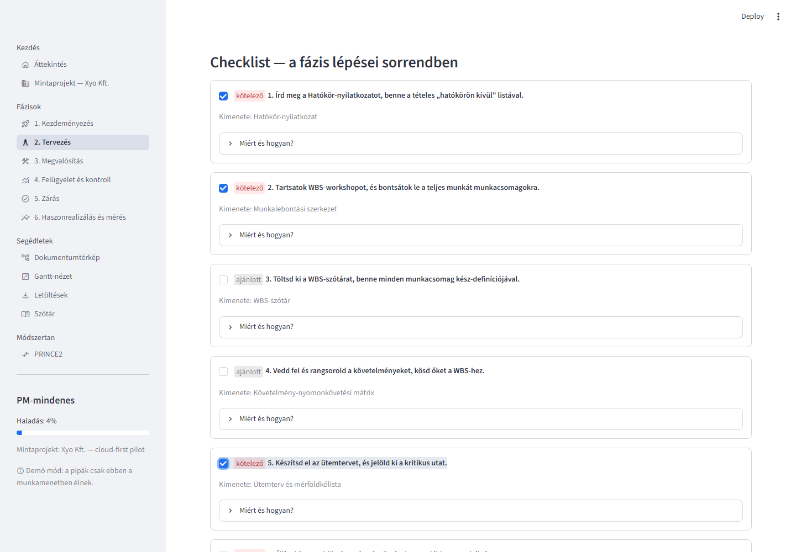
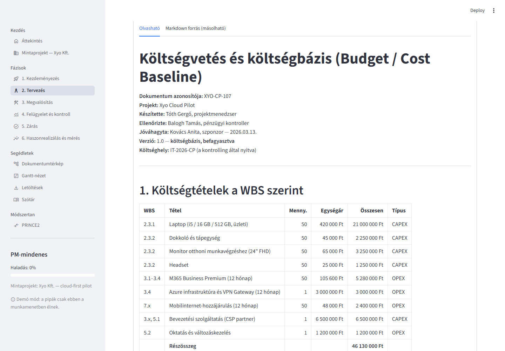
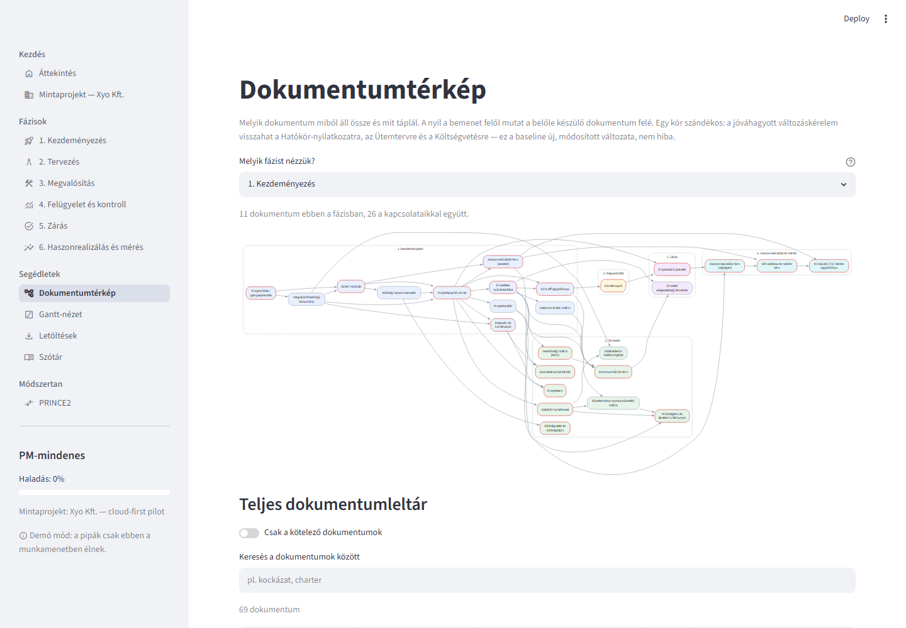
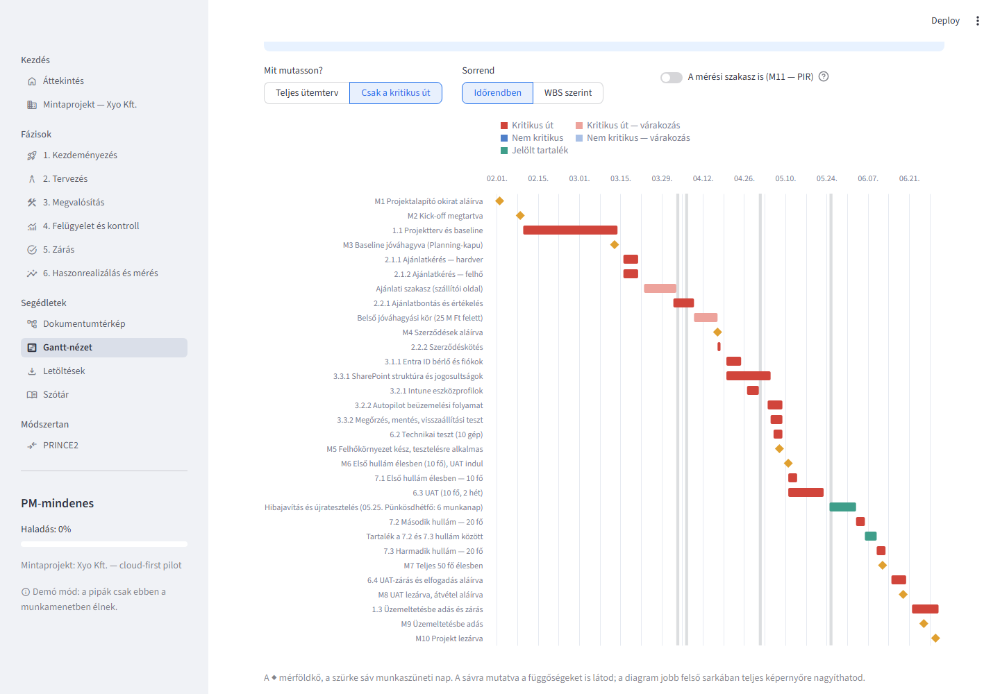
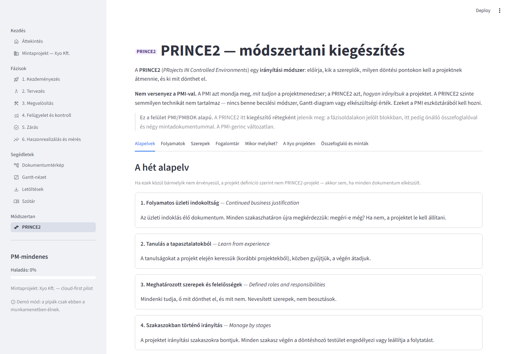

# PM-mindenes — munkakörnyezet waterfall projektekhez

[](https://github.com/htgitacc/pm-all-showcase/actions/workflows/tests.yml)


A PM-mindenes egy általam összeállított **munkakörnyezet
projektmenedzsereknek**. Egy helyen mutatja meg, hogy egy klasszikus
(waterfall) projektben fázisról fázisra milyen dokumentáció kell, miért,
mikor és kitől — és mindegyikhez ad leírást, sablont és kitöltött mintát.

**Módszertani alap:** a keret a **PMI/PMBOK**-ra épül, és annak öt
folyamatcsoportját követi (kezdeményezés, tervezés, megvalósítás, felügyelet és
kontroll, zárás), amit egy hatodik, haszonrealizálási és mérési szakasszal
egészítettem ki. Ehhez egy külön, jelölt **PRINCE2-réteg** is társul: a PMI-gerincet
nem módosítja, hanem megmutatja, hogyan feleltethető meg ugyanaz a projekt a
PRINCE2 folyamatainak és irányítási termékeinek. A réteg egy lépésben
eltávolítható, a PMI-gerinc ettől nem változik.

Többféleképpen használom:

- **checklistként**, amin végigszaladok egy projekt elején vagy egy fázis-kapu
  előtt;
- **emlékeztetőként**, ha csak azt kell tudnom, mi a következő lépés és mit kell
  letennem az asztalra;
- **sablon- és mintatárként**, ha egy konkrét dokumentumot kell megírnom;
- **tananyagként**: minden lépésnél ott az elmélet (miért kell, mitől véd meg,
  mi a tipikus hiba) és a gyakorlat (egy kész példa).

A keret projektfüggetlen: a fázisok, lépések és dokumentumok leírása külön
van a mintaprojekttől, így egy másik projekt dokumentumai ugyanebbe a
szerkezetbe tehetők. A mintadokumentumokat AI segítségével készítettem — és
ugyanígy készíthető hasonló mintacsomag egy másik projekt valós adataiból.

**A mintaprojekt a bizonyíték, nem a lényeg.** A kitalált Xyo Kft. 50 fős
felhőpilotja az ötlettől az utólagos értékelésig végigmegy a kereten, 69
kitöltött dokumentummal — ezzel igazolom, hogy egy teljes projektfolyamat
leképezhető vele.

> **English summary.** *PM-mindenes is a working environment I built for
> project managers running classic (waterfall) projects. For every phase it
> shows which documents are needed, why, when and from whom — each with a
> description, a template and a filled-in example. It is built on PMI/PMBOK
> and follows its five process groups, extended with a sixth benefits-realisation
> phase; a separate, clearly marked PRINCE2 layer maps the same project to
> PRINCE2 processes and management products without altering the PMI backbone.
> I use it as a checklist, a
> quick reminder, a template library and a learning aid: every step combines
> theory (why it matters, what it protects you from, the typical mistake) with
> practice (a worked example). The framework is project-independent: another
> project's documents fit into the same structure, and a comparable sample set
> can be produced with AI from a real project's context — which is how the
> included samples were made. A fictional 50-user cloud pilot at Xyo Kft., with
> 69 filled-in documents from the first idea to the post-implementation review,
> validates that a complete project lifecycle can be mapped with it. The
> interface is in Hungarian. Built with Python and Streamlit.*

**▶ [Élő demó: pm-all-showcase.streamlit.app](https://pm-all-showcase.streamlit.app/)** —
kipróbálható böngészőben, telepítés nélkül. A pipák csak a saját
böngészőmunkamenetedben élnek. Az első betöltés lassabb lehet: az ingyenes
tárhely az inaktív appot alvó módba teszi.



## Mit fed le a keret?

| Terület | Hol látszik | Érdemes megnézni |
|---|---|---|
| Kezdeményezés és üzleti indoklás | Üzleti indoklás „ne csináljunk semmit" változattal, költség-haszon elemzés, Projektalapító okirat | [Projektalapító okirat](docs/1-initiation/05-projektalapito-okirat.md) |
| Tervezés és baseline | WBS, költségbázis tartalékszabállyal, RACI, kockázatnyilvántartás | [Költségvetés](docs/2-planning/07-koltsegvetes.md) |
| Ütemtervezés | Ütemterv kritikus úttal és mérföldkövekkel, a felületen Gantt-nézettel | [Ütemterv](docs/2-planning/06-utemterv.md) |
| Beszerzés | Beszerzési terv, ajánlatkérés, értékelési szempontrendszer, ajánlat-összehasonlítás, szerződés | [Ajánlat-összehasonlítás](docs/3-execution/03-ajanlat-osszehasonlitas.md) |
| Kontroll és riportálás | Heti státusz, Steering riport, változáskezelés, EVM — egy elrontott és egy javított számítással | [EVM-elemzés](docs/4-monitoring/06-evm-elemzes.md) |
| Követelmények és minőség | Követelmény → teszteset → átvételi kritérium → szerződéses feltétel lánc, UAT, minőségellenőrzés | [Követelmény-mátrix](docs/2-planning/05-kovetelmeny-matrix.md) |
| Zárás | Átadás-átvétel, pénzügyi zárás, tanulságok, archiválás | [Projektzáró jelentés](docs/5-closure/03-projektzaro-jelentes.md) |
| Haszonrealizálás | T0 kiindulási mérés a projekt előtt, havi mérések, utólagos értékelés (PIR), kiterjesztési javaslat | [PIR](docs/6-benefits/06-pir.md) |
| Módszertani rálátás | PRINCE2-leképezés: PID, Highlight, Exception és End Stage Report | [PRINCE2 összefoglaló](docs/prince2/00-prince2-osszefoglalo.md) |

## Képernyőképek

| Fázis-checklist | Kitöltött mintadokumentum |
|---|---|
|  |  |
| **Dokumentumtérkép** | **Gantt-nézet — a mintaprojekt kritikus útja** |
|  |  |

## Hogyan használható?

| Mire kell | Hogyan használom |
|---|---|
| **Checklist** | Végigszaladok a fázis lépésein, a kötelezőket külön jelöli; a pipák mentődnek |
| **Emlékeztető** | A fázisoldal tetején látom, mi a dolgom, kitől mit kérek be, mit kell letennem az asztalra |
| **Sablon- és mintatár** | Egy dokumentumkártyán a leírás mellett a kitöltött példa, markdownban másolható |
| **Tananyag** | Minden dokumentumnál: mire jó, mitől véd meg, mi a bemenete, mihez lesz bemenet, mi a tipikus hiba |
| **Átlátás** | A Dokumentumtérkép megmutatja, melyik dokumentum miből áll össze és mit táplál |

## Mit tud?

- **Fázisonkénti checklist** kötelező / ajánlott jelöléssel; a pipák a
  `data/progress.json` fájlba mentődnek, tehát túlélik az újraindítást
  (demó módban csak a munkamenetben élnek).
- **Dokumentumkártyák**: mire jó, mitől véd meg, mi a bemenete, mihez lesz bemenet,
  mi a tipikus hiba — és a kitöltött Xyo-minta olvasható és markdown formában.
- **Dokumentumtérkép**: a doksik függőségi gráfja és a teljes, kereshető leltár.
- **Gantt-nézet** *(kiegészítő)*: a mintaprojekt baseline ütemterve kritikus úttal,
  várakozási idővel, jelölt tartalékkal, munkaszüneti napokkal és a mérföldkövek
  terv–tény összevetésével — közvetlenül az Ütemterv mintadokumentumból rajzolva.
- **Letöltések**: minták egyesével, fázisonként zip-ben, vagy teljes csomagként.
- **Szótár**: magyar–angol PM fogalomtár junior magyarázatokkal.
- **PRINCE2**: módszertani kiegészítés — kb. 10 oldalas összefoglaló, PMI↔PRINCE2
  fogalomtár, és négy PRINCE2-specifikus mintadokumentum a Xyo projekt adataival.

## Saját projekt a keretben

A keret és a minta szét van választva:

| Réteg | Hol van | Projektfüggő? |
|---|---|---|
| Fázisok, lépések, dokumentumleírások (miért kell, mitől véd, bemenet/kimenet, tipikus hiba) | `content/phases/*.yaml` | **nem** |
| Mintaprojekt adatai | `content/meta.yaml` | igen |
| Kitöltött mintadokumentumok | `docs/<fázis>/*.md` | igen |

Egy másik projekthez a mintafájlokat és a mintaprojekt adatait kell kicserélni;
a fázisok szerkezete, a checklist és a dokumentumleírások maradnak.

1. Írd meg a mintát a `docs/<fázis>/` mappába.
2. Vedd fel a fájl útvonalát a fázis YAML-jában az adott dokumentum
   `sample_file` mezőjébe.
3. Indítsd újra az appot — a minta megjelenik, letölthetővé válik, és bekerül a
   zip csomagokba.

Új dokumentumhoz a fázis YAML `documents` listájába kell egy új bejegyzés
(`id`, `name_hu`, `name_en`, `mandatory`, `why`, `inputs`, `feeds`). Az `inputs`
és `feeds` mezők adják a Dokumentumtérkép éleit; a hibás hivatkozásokat az app
indításkor kiírja az oldalsávon.

**AI és a minták.** A Xyo-mintákat AI-asszisztenssel készítettem, és ugyanígy
készíthető hasonló csomag egy másik projekt valós adataiból. Az alkalmazáson
belüli generálás és a szerkesztés a felületen **továbbfejlesztési irány, még
nem kész funkció**.

## Minőségbiztosítás

A mintaprojekttel azt akartam igazolni, hogy a keretben egy teljes projekt
végigvihető — ehhez a mintának belül is hitelesnek kell lennie. A 69 dokumentum
egymásra épül: ugyanaz a szám — a keret, egy dátum, egy darabszám — sok helyen
szerepel, és egy ilyen csomagban a hiba jellemzően nem egy dokumentumon belül,
hanem **a dokumentumok között** van.

Ezért a számokat és a logikát **automatizált tesztek alá tettem** (`tests/`,
152 db, GitHub Actions minden pushnál):

- a költségvetést a fizetési ütemezéssel és a pénzügyi zárással,
- az ütemtervet a munkaszüneti napokkal, a függőségekkel és a kritikus úttal,
- a mérési láncot a kiindulási méréstől a kiterjesztési javaslatig,
- az erőforrástervet a WBS-sel és a RACI-val,
- a nyilvántartásokat (változás-, döntés-, probléma- és eszkalációs napló) az
  összesítőikkel,
- a követelményeket a teszteseteken és az átvételi kritériumokon át a
  szerződéses feltételekig,
- a riportokat azzal, ami a kiadásuk napján a nyilvántartásokban állt.

A tartalmat hét körben, területenként átvizsgáltam. A tesztek erejét mutációs
próbával ellenőriztem: szándékosan elrontott számokon el kell bukniuk — és el
is buknak.

## Hogyan készült?

A projekt **AI-asszisztenssel (Claude) közös munkában** készült — ezt a
commitok `Co-Authored-By` sora is jelöli.

**Az ötlet.** Az indulás az volt, hogy mennyit segíthet az AI egy projektmenedzser
munkájában, folyamatában. Szerettem volna egy oldalt, ahol a gyakorlatban használt
és javasolt dokumentumokról sablonbázis készül, kezelve a dokumentumok közti
függőségeket, és jelezve, hogy melyik melyik fázishoz kapcsolódik.

**A munkamegosztás.** Én készítettem a vázlatos tervet ([pm-initial.md](pm-initial.md)),
az AI a struktúrát javasolta. Néhány helyen korrigálni kellett: ahol nem adtam
elég előzetes korlátot, ott az AI több feladatot is előre megcsinált, mint
terveztem. Ez összességében nem okozott kárt, és nem hátráltatta a munkát —
csak előbb készített el néhány fázist, amihez még további információt adtam
volna. Ezeket utólag pótoltuk, és volt, hogy az utólagos pótlás jobban
sikerült, mert a már kész fázist látva pontosabban tudtam megfogalmazni, mit
szeretnék.

**Amit viszek tovább.** A projekt kezdete óta több fejlesztést is elkezdtem és
folytattam, mindegyikből tanultam: pontosabb instrukciók a fejlesztési
dokumentációkra, a tesztek kiemelt szerepe, a korlátok pontosabb felállítása.
Ezek apró változások, de minden újabb projektben igyekszem felhasználni a
korábbi tapasztalatokat.

**Mire készült, és mi jön.** A munka elsősorban tanulási folyamat volt: az volt a
cél, hogy végigmenjek egy waterfall PM-folyamaton. Egyben kísérlet is arra,
hogy van-e értelme egy ilyen összefoglalónak: mennyire használható a
gyakorlatban, és tényleg spórol-e időt. A következő lépésben időt kell
szánnom arra, hogy a gyakorlatban kipróbáljam, vagy legalább tesztkörnyezetben
elkészítsek vele néhány projektet. Utána dönthető el, érdemes-e további
fejlesztésbe energiát fektetni, vagy kísérleti munka marad.

## Indítás helyben

```bash
pip install -r requirements.txt
```

```bash
streamlit run app.py
```

A felület a `http://localhost:8501` címen nyílik meg.

### Tesztek

```bash
pip install -r requirements-dev.txt
```

```bash
pytest
```

| Fájl | Mit ellenőriz |
|---|---|
| `test_content.py` | A tartalom szerkezete: azonosítók, hivatkozások, mintafájlok, a README táblája, YAML- és markdown-csapdák |
| `test_figures.py` | Pénzügy: költségvetés, havi költségbázis és fizetési ütemezés, pénzügyi zárás, EVM, célok, riportszám |
| `test_benefits.py` | Mérési lánc: T0 → havi mérések → kérdőív → PIR → kiterjesztési javaslat, a sikerkritérium hézagmentessége |
| `test_schedule.py` | Ütemterv: naptári napok, munkaszüneti napok, függőségek, kritikus út, dátumok összhangja |
| `test_resources.py` | WBS-órák, erőforrásterv, RACI, kockázati pontszámok és darabszámok |
| `test_gantt.py` | A Gantt-nézet: minden ütemtervsor és mérföldkő a dokumentum dátumaival, a tartalékok és munkaszüneti napok, minden nézetváltozat |
| `test_registers.py` | Nyilvántartások: változásnapló és tartalékegyenleg, döntés-, probléma- és eszkalációs napló, hibalista, átvételi kritériumok, fizetési ütemezés és kötbér |
| `test_quality.py` | Követelmény-nyomonkövetés (követelmény → teszteset → átvételi kritérium → szerződéses feltétel), tesztkörök, minőségellenőrzés, beszerzési pontozás, oktatás, érintettek–RACI–kommunikáció, archiválási jegyzék |
| `test_reports.py` | Riportok a kiadásuk napjára vetítve: státusz-, Steering- és kockázati riport, EVM-pont, eszkalációk, PRINCE2 highlight / exception / end stage report, hírlevelek, jegyzőkönyv-számozás |
| `test_progress.py` | A checklist-haladás mentése, törlése, demó mód |
| `test_pages.py` | Minden oldal hiba nélkül lefut; a hosszú szöveges táblák tördelnek (nem vágódnak le); a letöltési csomag teljes |

### Demó mód (nyilvános telepítéshez)

Alapértelmezetten a pipák a `data/progress.json` fájlba mentődnek. Nyilvános
telepítésnél ez azt jelentené, hogy minden látogató ugyanazokat a pipákat
látja és írja felül. Ezért van egy demó mód, amelyben a haladás csak az adott
böngészőmunkamenetben él:

```bash
PM_MINDENES_STORAGE=session streamlit run app.py
```

Streamlit Community Cloudon ugyanez a Secrets-ben: `PM_MINDENES_STORAGE = "session"`.

## Mappastruktúra

```
app.py                  Streamlit belépőpont, oldalsáv-navigáció
pm_app/
  config.py             útvonalak, konstansok
  content.py            YAML betöltés, dokumentum-index, validáció
  progress.py           a pipák mentése/olvasása
  render.py             újrafelhasználható UI blokkok
  views.py              az egyes oldalak
  downloads.py          md letöltés és zip csomagolás
  gantt.py              a Gantt-nézet (kiegészítő, egy lépésben eltávolítható)
content/
  meta.yaml             bevezető, mintaprojekt adatai, szótár
  prince2.yaml          a PRINCE2 kiegészítő réteg tartalma
  phases/*.yaml         a hat fázis teljes tartalma (+ fázisonkénti prince2 blokk)
docs/<fázis>/*.md       a kitöltött Xyo-minták
docs/prince2/*.md       PRINCE2 összefoglaló + 4 mintadokumentum
data/progress.json      a pipák állapota (git-ignorálva)
tests/                  pytest: tartalom, számok, mérési lánc, ütemterv, Gantt-nézet, erőforrás és kockázat, nyilvántartások, követelmények, riportok, haladás, oldalak
.github/workflows/      CI: a tesztek futtatása minden pushnál
pm-initial.md           a termék eredeti koncepciója
docs/screenshots/       a README képernyőképei (újragyártás: tools/screenshots.py)
tools/screenshots.py    a képernyőképek egységes gyártása headless Edge/Chrome-mal
LICENSE                 MIT (kód)
LICENSE-CONTENT.md      CC BY 4.0 (tartalom)
```

## Tartalmi állapot

| Fázis | Dokumentum | Ebből kötelező | Checklist | Kitöltött minta |
|---|---:|---:|---:|---|
| 1. Kezdeményezés | 11 | 7 | 15 | **mind a 11 kész** |
| 2. Tervezés | 20 | 14 | 21 | **mind a 20 kész** |
| 3. Megvalósítás | 13 | 12 | 14 | **mind a 13 kész** |
| 4. Felügyelet és kontroll | 9 | 6 | 12 | **mind a 9 kész** |
| 5. Zárás | 9 | 7 | 11 | **mind a 9 kész** |
| 6. Haszonrealizálás és mérés | 7 | 7 | 12 | **mind a 7 kész** |
| **Összesen** | **69** | **53** | **85** | **69 / 69** |

**A tartalom teljes.** Mind a 69 dokumentumhoz elkészült a kitöltött Xyo-minta,
a projekt teljes életciklusát végigkövetve: ötlet (2025.11.10.) → projekt
(2026.02.02 – 06.30.) → mérés (2026.07.01 – 09.30.) → kiterjesztési döntés
(2026.10.09.).

## PRINCE2-réteg

A felület **PMI/PMBOK alapú**. A PRINCE2 **kiegészítő rétegként** jelenik meg,
és **nem módosítja a PMI-gerincet**: a 69 dokumentum, a 85 checklist elem és a
dokumentumtérkép változatlan.



| Hol | Mit |
|---|---|
| **PRINCE2 oldal** (`Módszertan` csoport) | Összefoglaló, alapelvek, folyamatok, szerepek, PMI↔PRINCE2 fogalomtár, „mikor melyiket?", a Xyo projekt PRINCE2-leképezése, 4 mintadokumentum |
| **Fázisoldalak alján** | Jelölt, összecsukott *PRINCE2-kiegészítés* blokk: melyik folyamatnak felel meg a fázis, mit tenne hozzá, milyen irányítási termékekkel |

A réteg egy lépésben eltávolítható: `content/prince2.yaml`, `docs/prince2/`,
a fázis-YAML-ok `prince2:` blokkja, és a `render.prince2_block` /
`views.prince2` függvények.

## Gantt-nézet

A **Segédletek → Gantt-nézet** oldal a mintaprojekt ütemtervét rajzolja ki.
Nincs saját adata: az *Ütemterv és mérföldkőlista* (2. fázis) tábláját és a
*Mérföldkő-riport* (4. fázis) tény-dátumait olvassa, így a diagram nem térhet
el a dokumentumoktól — és a `tests/test_schedule.py` ütemterv-ellenőrzései
egyben a diagramot is védik.

| Mit mutat | Honnan |
|---|---|
| Kritikus út (piros), nem kritikus feladatok (kék) | az ütemterv „KU" oszlopa |
| Várakozás: ajánlati szakasz, belső jóváhagyás, szállítás (halvány) | a WBS-azonosító nélküli sorok |
| Jelölt tartalék: hibajavítási ablak, a 7.2–7.3 hullám közti rés (zöld) | az ütemterv 5. pontja |
| Mérföldkövek terv és tény szerint, munkaszüneti napok | az ütemterv 1. pontja, a Mérföldkő-riport |

Szűrhető a kritikus útra, rendezhető időrendben vagy WBS-áganként, és a mérési
szakasz (PIR) is bekapcsolható. A PMI-gerincet nem módosítja; eltávolítás egy
lépésben: `pm_app/gantt.py`, az `app.py` „Gantt-nézet" oldala és a
`tests/test_gantt.py`.

## Tartalmi elvek

- **PMI/PMBOK** a módszertani gerinc; a PRINCE2 jelölt kiegészítő réteg.
- Magyar szöveg, az angol szakkifejezés zárójelben.
- Ahol egy szempont az adott fázisban nem értelmes, ott **kimarad** — nem
  töltjük ki üres szöveggel.
- Minden dokumentumnál szerepel, hogy **mitől védi meg a projektmenedzsert**.

## Továbbfejlesztési irányok

- Szerkesztés a felületen (ma a minták csak olvashatók; másolás és letöltés működik).
- Az alkalmazáson belüli mintagenerálás egy másik projekt valós adataiból.
- Több párhuzamos projekt kezelése (ma a haladás egyetlen, közös projektre vonatkozik).

## Licenc

- A **kód** (`app.py`, `pm_app/`, `tests/`): [MIT](LICENSE).
- A **tartalom** (`content/`, `docs/`, a képernyőképek): [CC BY 4.0](LICENSE-CONTENT.md) —
  szabadon felhasználható és átdolgozható, a forrás megjelölésével.

A Xyo Kft., a szereplők és a szállítók kitaláltak; bármilyen egyezés a valósággal
a véletlen műve. A Microsoft-termékek nevei a Microsoft védjegyei.
